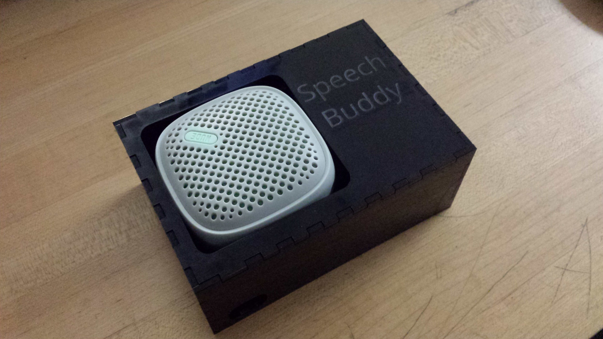
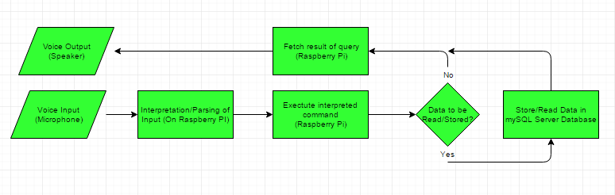

March 28th, 2017

\pagebreak

Speech Buddy Project
====================

[Speech Buddy Github](https://willcodyanderson.github.io/)

Declaration of Joint Authorship
===============================

We, William Anderson, Kevin Dang and Sanjay Jerad, confirm that this work
submitted for assessment is our own and is expressed in our own words.

William holds scrum master position. In charge of development at the back-end of
the SpeechBuddy project.

Sanjay created the graphical user interface for the android application.

Kevin in charge of data storage for the project. Data stored in an external
database.

Our team “Arrested Developers” agree that the Speech Buddy project is a group
involvement, using every member’s own ideas and knowledge throughout the entire
duration of the build.

Any uses made within it of the works of any other author, in any form (ideas,
equations, figures, texts, tables, programs), are properly acknowledged at the
point of use. Any outside knowledge we used for the creation of the project,
will be cited down in the references at the bottom of the TR. We acknowledge any
work used that does not belong to us and respect their proper ownership.

It is mandatory that all sources of information be acknowledged in the TR.
Plagiarism is unethical, irresponsible and criminal.

\pagebreak

Proposal
========

Summary
-------

An intelligent voice interface that is able to listen and interpret what the
user has spoken. Input will be translated into text and stored in a Database.

Problem
-------

The problem this project solves is that it helps users take simple notes, such
as a grocery list or small reminders for when you don’t have a pen and paper
available. This project will help solved problems where people forget an
important detail or appointment, by storing what the user says into a readable
text format.

Similar to Apples Siri and Microsoft’s Cortana.

Description
-----------

As students in the Computer Engineering Technology program, we will be
integrating the knowledge and skills we have learned from our program into this
Internet of Things themed capstone project. This proposal requests the approval
to build the hardware portion that will connect to a Database as well as to a
mobile device application. The internet connected hardware will include a custom
PCB with sensors and actuators for *speech recognition and voice recording*. The
Database will store *what the user says in a readable format saved on a
Database*. The mobile device functionality will include *storage for the
recorded text and any reminders* and will be further detailed in the mobile
application proposal. we will be collaborating with the following
company/department, *we will not be collaborating with any companies at this
moment*. The hardware will be completed in CENG 317 Hardware Production
Techniques independently and the application will be completed in CENG 319
Software Project. These will be integrated together in the subsequent term in
CENG 355 Computer Systems Project.

Background
----------

There are several applications and hardware out there that utilize speech as
input, such as Apple’s Siri, Microsoft’s Cortana or Amazon’s Alexa. Some other
hardware and software similar to our projects are Digital pens. This piece of
hardware records what users write down as input, and saves it in a text format
on the computer. In this era there is not much mention of using a person’s voice
as input, and has not been a part a person’s daily lives. You don’t see people
talking to their phone or microphone everywhere you look.

We have searched for prior art via Humber’s IEEE subscription selecting “My
Subscribed Content” and have found and read the below articles, which provides
insight into similar efforts.

The first article contains information related to text-to-speech output in
technology. [@5174430]

The second article’s information is about discriminating between vocal sounds
and environment sounds. [@7079726]

The third article relates to the behaviour of speech with service robots.
[@5565459]

In the Computer Engineering Technology program we have learned about the
following topics from the respective relevant courses:

-   Java Docs from CENG 212 Programming Techniques In Java,

-   Construction of circuits from CENG 215 Digital And Interfacing Systems,

-   Rapid application development and Gantt charts from CENG 216 Intro to
    Software Engineering,

-   Micro computing from CENG 252 Embedded Systems,

-   SQL from CENG 254 Database With Java,

-   Web access of Databases from CENG 256 Internet Scripting; and,

-   Wireless protocols such as 802.11 from TECH152 Telecom Networks.

This knowledge and skill set will enable us to build the subsystems and
integrate them together as my capstone project.

Methodology and Schedule
------------------------

Phase 1 Hardware build.  
Phase 2 System integration.  
Phase 3 Demonstration to future employers.

*Phase 1 Hardware build*

The hardware build will be completed in the fall term. It will fit within the
CENG Project maximum dimensions of 12 13/16" x 6" x 2 7/8" (32.5cm x 15.25cm x
7.25cm) which represents the space below the tray in the parts kit. The highest
AC voltage that will be used is 16Vrms from a wall adaptor from which +/- 15V or
as high as 45 VDC can be obtained. Maximum power consumption will be 20 Watts.

*Phase 2 System integration*

The system integration will be completed in the Winter term.

*Phase 3 Demonstration to future employers*

This project will showcase the knowledge and skills that we have learned to
potential employers.

The tables below provide rough effort and non-labour estimates respectively for
each phase. A Gantt chart will be added by week 3 to provide more project
schedule details and a more complete budget will be added by week 4. It is
important to start tasks as soon as possible to be able to meet deadlines.

| **Labour Estimates**                                                                                                                                                                                                                                                                                                                  | **Hrs**          | **Notes**                                                                                                                      |
|---------------------------------------------------------------------------------------------------------------------------------------------------------------------------------------------------------------------------------------------------------------------------------------------------------------------------------------|------------------|--------------------------------------------------------------------------------------------------------------------------------|
| **Phase 1**                                                                                                                                                                                                                                                                                                                           |                  |                                                                                                                                |
| Writing proposal.                                                                                                                                                                                                                                                                                                                     | 9                | Tech identification quiz.                                                                                                      |
| Creating project schedule. Initial project team meeting.                                                                                                                                                                                                                                                                              | 9                | Proposal due.                                                                                                                  |
| Creating budget. Status Meeting.                                                                                                                                                                                                                                                                                                      | 9                | Project Schedule due.                                                                                                          |
| Acquiring components and writing progress report.                                                                                                                                                                                                                                                                                     | 9                | Budget due.                                                                                                                    |
| Mechanical assembly and writing progress report. Status Meeting.                                                                                                                                                                                                                                                                      | 9                | Progress Report due (components acquired milestone).                                                                           |
| PCB fabrication.                                                                                                                                                                                                                                                                                                                      | 9                | Progress Report due (Mechanical Assembly milestone).                                                                           |
| Interface wiring, Placard design, Status Meeting.                                                                                                                                                                                                                                                                                     | 9                | PCB Due (power up milestone).                                                                                                  |
| Preparing for demonstration.                                                                                                                                                                                                                                                                                                          | 9                | Placard due.                                                                                                                   |
| Writing progress report and demonstrating project.                                                                                                                                                                                                                                                                                    | 9                | Progress Report due (Demonstrations at Open House Saturday, November 7, 2015 from 10 a.m. - 2 p.m.).                           |
| Editing build video.                                                                                                                                                                                                                                                                                                                  | 9                | Peer grading of demonstrations due.                                                                                            |
| Incorporation of feedback from demonstration and writing progress report. Status Meeting.                                                                                                                                                                                                                                             | 9                | 30 second build video due.                                                                                                     |
| Practice presentations                                                                                                                                                                                                                                                                                                                | 9                | Progress Report due.                                                                                                           |
| 1st round of Presentations, Collaborators present.                                                                                                                                                                                                                                                                                    | 9                | Presentation PowerPoint file due.                                                                                              |
| 2nd round of Presentations                                                                                                                                                                                                                                                                                                            | 9                | Build instructions up due.                                                                                                     |
| Project videos, Status Meeting.                                                                                                                                                                                                                                                                                                       | 9                | 30 second script due.                                                                                                          |
| **Phase 1 Total**                                                                                                                                                                                                                                                                                                                     | **135**          |                                                                                                                                |
| **Phase 2**                                                                                                                                                                                                                                                                                                                           |                  |                                                                                                                                |
| Meet with collaborators                                                                                                                                                                                                                                                                                                               | 9                | Status Meeting                                                                                                                 |
| Initial integration.                                                                                                                                                                                                                                                                                                                  | 9                | Progress Report                                                                                                                |
| Meet with collaborators                                                                                                                                                                                                                                                                                                               | 9                | Status Meeting                                                                                                                 |
| Testing.                                                                                                                                                                                                                                                                                                                              | 9                | Progress Report                                                                                                                |
| Meet with collaborators                                                                                                                                                                                                                                                                                                               | 9                | Status Meeting                                                                                                                 |
| Meet with collaborators                                                                                                                                                                                                                                                                                                               | 9                | Status Meeting                                                                                                                 |
| Incorporation of feedback.                                                                                                                                                                                                                                                                                                            | 9                | Progress Report                                                                                                                |
| Meet with collaborators                                                                                                                                                                                                                                                                                                               | 9                | Status Meeting                                                                                                                 |
| Testing.                                                                                                                                                                                                                                                                                                                              | 9                | Progress Report                                                                                                                |
| Meet with collaborators                                                                                                                                                                                                                                                                                                               | 9                | Status Meeting                                                                                                                 |
| Prepare for demonstration.                                                                                                                                                                                                                                                                                                            | 9                | Progress Report                                                                                                                |
| Complete presentation.                                                                                                                                                                                                                                                                                                                | 9                | Demonstration at Open House Saturday, April 9, 2016 10 a.m. to 2 p.m.                                                          |
| Complete final report. 1st round of Presentations.                                                                                                                                                                                                                                                                                    | 9                | Presentation PowerPoint file due.                                                                                              |
| Write video script. 2nd round of Presentations, delivery of project.                                                                                                                                                                                                                                                                  | 9                | Final written report including final budget and record of expenditures, covering both this semester and the previous semester. |
| Project videos.                                                                                                                                                                                                                                                                                                                       | 9                | Video script due                                                                                                               |
| **Phase 2 Total**                                                                                                                                                                                                                                                                                                                     | **135**          |                                                                                                                                |
| **Phase 3**                                                                                                                                                                                                                                                                                                                           |                  |                                                                                                                                |
| Interviews                                                                                                                                                                                                                                                                                                                            | TBD              |                                                                                                                                |
| **Phase 3 Total**                                                                                                                                                                                                                                                                                                                     | **TBD**          |                                                                                                                                |
| **Material Estimates**                                                                                                                                                                                                                                                                                                                | **Cost**         | **Notes**                                                                                                                      |
| **Phase 1**                                                                                                                                                                                                                                                                                                                           |                  |                                                                                                                                |
| A microcomputer composed of a quad-core Windows 10 IoT core compatible Broadcom BCM2836 SoC with a 900MHz Application ARM Cortex-A7 32 bit RISC v7-A processor core stacked under 1GB of 450MHz SDRAM, 10/100 Mbit/s Ethernet, GPIO, UART, I²C bus, SPI bus, 8 GB of Secure Digital storage, a power supply, and a USB Wi-Fi adaptor. | \\\$120.00       | Amazon                                                                                                                         |
| Microphone                                                                                                                                                                                                                                                                                                                            | \\\$20.00        |                                                                                                                                |
| Speaker                                                                                                                                                                                                                                                                                                                               | \\\$28.99        |                                                                                                                                |
| CENG Parts Kit                                                                                                                                                                                                                                                                                                                        | \\\$110.00       |                                                                                                                                |
| J206 Parts                                                                                                                                                                                                                                                                                                                            | \\\$40.00        |                                                                                                                                |
| Project Case                                                                                                                                                                                                                                                                                                                          | \\\$13.00        |                                                                                                                                |
| **Phase 1 Total**                                                                                                                                                                                                                                                                                                                     | **\>\\\$331.99** |                                                                                                                                |
| **Phase 2**                                                                                                                                                                                                                                                                                                                           |                  |                                                                                                                                |
| Materials to improve functionality, fit, and finish of project.                                                                                                                                                                                                                                                                       | N/A              |                                                                                                                                |
| **Phase 2 Total**                                                                                                                                                                                                                                                                                                                     | **TBD**          |                                                                                                                                |
| **Phase 3**                                                                                                                                                                                                                                                                                                                           |                  |                                                                                                                                |
| Off campus colocation                                                                                                                                                                                                                                                                                                                 | \<\\\$100.00     |                                                                                                                                |
| *Shipping*                                                                                                                                                                                                                                                                                                                            | *TBD*            |                                                                                                                                |
| *Tax*                                                                                                                                                                                                                                                                                                                                 | *TBD*            |                                                                                                                                |
| *Duty*                                                                                                                                                                                                                                                                                                                                | *TBD*            |                                                                                                                                |
| **Phase 3 Total**                                                                                                                                                                                                                                                                                                                     |                  |                                                                                                                                |

Concluding Remarks
------------------

This proposal presents a plan for providing an IoT solution for better planning
and helps people set reminders of important details. This is an opportunity to
integrate the knowledge and skills developed in our program to create a
collaborative IoT capstone project demonstrating my ability to learn how to
support projects. I request approval of this project.

\pagebreak

Abstract
========

This report contents information specifying a Voice interface build project.
This project hopes to create a fully functioning Voice interface that will
complete simple tasks given to it via speech detect. Similar to Apples Siri and
Microsoft’s Cortana. Information in regards to the build material and cost of
this project are listed in this report. Material such as a raspberry Pi, USB
microphone and mini speakers were used, in total the SpeechBuddy project’s
estimated cost is \$230. SpeechBuddy will help people with better planning and
organization, letting them set info about important details. This project will
roughly take up to 8 months to complete. Data is stored in an external database
hosted on Firebase. The android application is a simply structure that displays
the list the user created via voice input.

\pagebreak

Table of Contents
=================

### 1. [Declaration of Sole Authorship](#declaration-of-joint-authorship)

### 2. [Proposal](#proposal)

2.1 [Summary](#summary)

2.2 [Problem](#problem)

2.3 [Description](#description)

2.4 [Background](#background)

2.5 [Methodology/Schedule](#methodology-and-schedule)

2.6 [Concluding Remarks](#concluding-remarks)

### 3. [Abstract](#abstract)

### 4. [Table of Contents](#table-of-contents)

### 5. [Illustrations and Diagrams](#illustrations-and-diagrams)

### 6. [Introduction](#introduction)

6.1 [Objective](#objective)

6.2 [Technical Problem](#technical-problem)

### 7. [Project Description](#project-description)

### 7.1 [Database Specifications](#database-specifications)

7.1.1 [Database Type](#database-type)

7.1.2 [Database Tables](#database-tables)

7.1.3 [Database Alteration via User Case
Example](#database-alteration-via-user-case-examples)

### 7.2. [Mobile Application Specifications](#mobile-application-specifications)

7.2.1 [GUI Specifications](#graphical-user-interface-specifications)

7.2.2 [Database Integration](#database-integration)

7.2.3 [Sample User Cases](#user-cases)

7.2.4 [Application Work Contributions](#application-work-contributions)

### 7.3. [Additional Web Specifications](#additional-web-specifications)

7.3.1 [Amazon Voice Services](#amazon-voice-services)

7.3.2 [Firebase Hosting](#firebase-database)

7.3.3 [DynamoDB Database](#dynamoDB-database)

7.4 [Progress Reports](#progress-reports)

7.4.1 [Status Report](#status-report)

7.4.1 [Integration Report](#integration-report)

7.4.1 [Troubleshoot Report](#troubleshoot-report)

### 7.5 [Construction](#construction)

7.5.1 [Construction Introduction](#construction-introduction)

7.5.2 [Creating The Database](#creating-the-database)

7.5.3 [Alexa Skill](#alexa-skill)

7.5.4 [Adding](#adding)

7.5.5 [Deleting](#deleting)

7.5.6 [Error Checking](#error-checking)

7.5.7 [Project Case](#project-case)

7.5.8 [Android Application](#android-application)

### 7.6 [Build Instructions](#build-instructions)

7.6.1 [Build Introduction](#build-introduction)

7.6.2 [Build Time](#build-time)

7.6.3 [Mechanical Assembly](#mechanical-assembly)

7.6.4 [Software Setup](#software-setup)

7.6.5 [Alexa Skill with Lambda](#alexa-skill-with-lamdba)

7.6.6 [Database Setup](#database-setup)

7.6.7 [Power Up and Testing](#power-up-and-testing)

7.6.8 [Colour Tutorial Setup](#colour-tutorial-setup)

### 8. [Conclusion](#conclusion)

### 9. [Recommendations](#recommendations)

### 10. [References](#references)

\pagebreak

Illustrations and Diagrams
==========================

The casing of the Speech Buddy, laser cut design can be found on our project
website.

System diagram of the project, describing general structure of how Speech Buddy
works.

\pagebreak

Introduction
============

Objective
---------

The objective of this project is to create a usable voice interface that will
help people with organization and planning. In this current age of time a mobile
phone is carried everywhere and used 24/7. We want to utilize this aspect to
create a unique interface with a virtual voice to help others in planning. If a
piece of technology is with people the majority of the time, why not use that
technology in an effort to help them.

Technical Problem
-----------------

The problem solved by this project is that it helps users take simple notes,
such as a grocery list or small reminders for when you don’t have a pen and
paper available. This project will help solve problems where people forget an
important detail or appointment, by storing what the user says into a readable
text format.

Some problems that were encountered in constructing the Speech Buddy, was trying
to convert spoken words into text on the Raspberry Pi. We tackled this problem
by first utilizing the “espeak” library on the Pi. This did not provide enough
efficiency, until we discovered Amazon’s Alexa voice service. This voice service
allowed us to create specific tasks for the voice to do, making it easier to
program speech conversion, and database storage. Another problem was
connectivity, the Alexa voice service requires internet access, we have a wired
connection using an Ethernet cable. Portability is a big issue.

\pagebreak

Project Description
===================

Database Specifications
-----------------------

### Database Type

Firebase is the Database type that is used for Speech Buddy. Firebase is a JSON
style Database that is organized via encrypted keys. It is incorporated directly
in android studio for ease of use with mobile applications wanting to store data
online.

### Database Tables

There are three tables that are used in the Firebase.

1.  Users

2.  ListNames

3.  ItemNames

**Users** is the table in which all users who sign up for our Speech Buddy
Application are stored. They are given a key as a unique identifier.

**ListNames** is the table in which the names of list the user created are
stored as strings. Each Users own Lists that they have created will be unique to
them via an identification key within the table.

**ItemNames** is the table in which the items under each list are stored. Each
Item is unique to the list name it was created under and the user that created
it via an identification key within the table.

### Database Alteration via User Case Examples

User case: The User Adds a list named “groceries” to their speech buddy.

Consequences: A string element “groceries” and key unique to the user are
generated in a new row under the ListNames table.

User case: The User Creates an Account with username <steve@abc.com> and
password “123”

Consequences: A string element (in mandatory email format) “steve\@abc.com”, a
string password “123” and key unique to the newly made user are generated in a
new row under the Users Table. All data manipulation under their account will
use this identifier, and they must use these credentials to access the
application.

User case: The User Adds an Item named “rice” to their “groceries” list.

Consequences: a string element “rice” and key unique to the user are generated
in a new row under the ListNames table.

Mobile Application Specifications
---------------------------------

### Graphical User Interface Specifications

**Login Activity:** The login screen of the application is the first presented
upon launching the application. The user may enter already existing credentials
into EditText fields and login, or may choose to go to the sign up activity,
both navigations via Buttons.

**Sign Up Activity:** The sign up screen of the application can be accessed from
the login menu. It has two EditText fields for new credentials to be added,
which upon submitting via Button will be verified by the username and password
guidelines and added to the user database. Incorrect EditText entries will be
communicated via Toast message asking for re-entry.

**List Activity:** The list activity of the application is comprised of a single
list, formatted appropriately, displayed across the width of the screen in both
portrait and landscape orientation. It loads it’s elements from the database
dynamically. If the list length exceeds the screen size, the list becomes
scrollable. The top right has the dropdown navigation menu, and add list/delete
list buttons.

**Items Activity:** The item activity of the application is comprised of a
single list, formatted appropriately, displayed across the width of the screen
in both portrait and landscape orientation. It loads it’s elements from the
database dynamically. The elements it loads are specific to the parent list and
user selected. If the list length exceeds the screen size, the list becomes
scrollable. The top right has the dropdown navigation menu, and add item/item
list buttons.

**About Application Activity:** A simple activity describing the purpose and
contributors of the Speech Buddy Application via formatted TextViews.

**Dropdown Navigation Menu:** In the top right corner of post-login activities.
Allows the user to Navigate to list pages, the about page, and logout. Also has
an option to clear all data from the current users records to start anew.

**Additional Note:** For ease of use, users may also press and hold list/item
elements to delete them. Any deleted list will also delete it’s child items.

### Database Integration

The Speech Buddy Application uses the integrated Firebase libraries in Android
Studio to connect to the database. Once connected online, it actively retrieves
data and adds dynamically updates the lists displayed within the application.
All new elements added to the users lists and items are independently added to
the database as soon as they are entered for optimal up to date accuracy within
the database.

### User Cases

| Test case: 1                                                                                                                                                           |
|------------------------------------------------------------------------------------------------------------------------------------------------------------------------|
| Creating tables                                                                                                                                                        |
| Purpose: Purpose is to observe if our application has created a table that contains the columns. Columns we need are the ID and the name of all list the user created. |
| Precondition:                                                                                                                                                          |
| Steps:                                                                                                                                                                 |
| Expected Result: Table should be created with an ID that auto increments, and content the names for each column                                                        |

-   Have created a database

-   Make the columns need for table (Strings)

-   CREATE table statement

1.  Create a database using SQLite

2.  Make column names

3.  Create a String for the CREATE table

4.  Run the statement using database.execSQL()

5.  Go to where database saved and check if it is there

6.  Open database see if table is there

| Test case: 2                                                                                                                                        |
|-----------------------------------------------------------------------------------------------------------------------------------------------------|
| Insert data into Table                                                                                                                              |
| Purpose: Purpose is to observe if our application can allow users to enter data that will be stored in a database                                   |
| Precondition:                                                                                                                                       |
| Steps:                                                                                                                                              |
| Expected Result: Table should be created with an ID that auto increments and the String the user entered in the EditTextView for the correct column |

-   Have created a database

-   Have the data needed to insert into table

-   ID (auto incremented)

-   List name (user enters this)

1.  Get data to enter (list name) from EditTextView

2.  Save data in table made variables

3.  Insert the data into the table one row at a time

4.  Go to where database saved and check if it is there

5.  Open database see if table is there

| Test case: 3                                                                              |
|-------------------------------------------------------------------------------------------|
| Delete data into Table                                                                    |
| Purpose: Purpose is to let users remove any old list they have or mistakes they have made |
| Precondition:                                                                             |
| Steps:                                                                                    |
| Expected Result: The data enter by the user should be deleted from the table              |

-   Have created a database

-   Have the data you want to delete needed in the table

1.  Get the name of the list/data user wants to delete from table

2.  Create a DELETE statement using that name and the table name

3.  Run the statement using database.delete()

4.  Open database and table and see result

| Test case: 4                                                                            |
|-----------------------------------------------------------------------------------------|
| Delete all data on database                                                             |
| Purpose: Remove all the data in the database if user wants a fresh restart with no data |
| Precondition:                                                                           |
| Steps:                                                                                  |
| Expected Result: Database will contain tables with no data                              |

-   Have created a database

-   Have tables with data in them

1.  Go into setting activity and click button

2.  Confirm yes or no

3.  Run delete Statement for all data in columns

4.  Tables will still exist

| Test case: 5                                                                |
|-----------------------------------------------------------------------------|
| Blank inputs                                                                |
| Purpose: See what will be stored in the database if user enters blank items |
| Precondition:                                                               |
| Steps:                                                                      |
| Expected Result: A blank entry will be created in the database              |

-   Have created a database

-   Text box for user input

1.  Go into mylists

2.  Add a list will blank information

3.  Open database to see result

| Test case: 6                                                                                          |
|-------------------------------------------------------------------------------------------------------|
| Delete using a blank input                                                                            |
| Purpose: Observe what when user enters Blank, see how it affects the database                         |
| Precondition:                                                                                         |
| Steps:                                                                                                |
| Expected Result: Will look for a blank data in table and remove it, if it cannot find data do nothing |

-   Have created a database

-   Text box for user input

1.  Go into mylists

2.  Delete a list will blank information

3.  Open database to see result

| Test case: 7                                                                         |
|--------------------------------------------------------------------------------------|
| User hits the back key on application                                                |
| Purpose: To test if the application will close if user clicks the back key           |
| Precondition:                                                                        |
| Steps:                                                                               |
| Expected Result: Application should prompt user if they want to exit the application |

-   Run the application

-   VM of android phone

1.  Run the application

2.  clicks the back key

| Test case: 8                                                                                          |
|-------------------------------------------------------------------------------------------------------|
| Delete using a blank input                                                                            |
| Purpose: Observe what when user enters Blank, see how it affects the database                         |
| Precondition:                                                                                         |
| Steps:                                                                                                |
| Expected Result: Will look for a blank data in table and remove it, if it cannot find data do nothing |

-   Have created a database

-   Text box for user input

1.  Go into mylists

2.  Delete a list will blank information

3.  Open database to see result

| Test case: 9                                                                                                     |
|------------------------------------------------------------------------------------------------------------------|
| Enter a list with the same name as another                                                                       |
| Purpose: Test to see if database will create two data entries that are the same                                  |
| Precondition:                                                                                                    |
| Steps:                                                                                                           |
| Expected Result: If you click any of the listnames with the same name, the item data is the same for all of them |

-   Have created a database

-   Enter data for both list and item tables

1.  Enter 2 entries with the same listname

2.  Click one of them and enter an item

### Application Work Contributions

**William:** The acting scrum master of the project. William is in charge of
back-end development including Java and using libraries and API’s. He manages
the overall architecture and functionality of the project.

**Sanjay:** In charge of the Graphical User Interface and User experience.
Different Graphical interfaces for both mobile phones and tablets. Designs
layouts and recommends functionality to William to be implemented.

**Kevin:** In charge of data storage, manipulation and maintenance. Created the
Firebase database, as well as its internal structure and breakdown to be
connected to via Firebase Java libraries.

Additional Web Specifications
-----------------------------

### Amazon Voice Services

The Speech Buddy Hardware utilizes Amazon Voice Libraries for voice input to be
added to the database. In addition to the JavaScript classes built for Speech
Buddy, Amazon Voice Services offers basic user searches via an online search
engine and can answer simple questions. Use of Amazon Alexa “skill” creation to
make use of the libraries to connect to the external Firebase database.

### Firebase Database

The Speech Buddy Hardware and application will be utilizing Firebase databases
for data storage. The service offers free (to a certain amount of traffic) data
hosting and an appropriate size and speed for Speech Buddy’s Requirements.

### DynamoDB Database

an Amazon Web Service that allows for the create of tables for data storage, and
manipulation. Service is free only if data being written to it is not over a
certain capacity ans size. Belongs to the same service and company as the Alexa
voice service, allowing for easy integration of hardware and software.

Progress Reports
================

### Status Report – sent by Sanjay Jerad [02/14/2017]

Development of Speech Buddy’s primary Amazon Voice Service Skill has begun; it
is being coded in JavaScript as Amazon Voice Services has the most support for
this language. The skill will be the final connection between the Speech Buddy
Hardware and the Speech Buddy mobile application, allowing the data shared
between the two to be shared synchronously. For testing purposes, simple
pre-made skills such as a basic color skill are being deployed to the Speech
Buddy hardware to ensure integration capabilities of our hardware.

Speech Buddy has also had a new case designed for the hardware. The previous
case model had joints and edges that were too thin by human error and could not
support the cases structure. The case has been redesigned to be stronger, as
well as have the size of the microphone hole adjusted to the most recent
microphone we have been using. The new box is intended to be printed February
14th.

Budget wise, Speech Buddy has gone under no significant changes. The cost of the
box could be assumed to be approx.  \$7.50 – \$10.00, as it consumes
approximately ¼ - 1/3 of a sheet of acrylic.

In relation to our project plan, we are technically caught up, but development
of Speech Buddy itself has slowed prior to this and must be made up for within
the coming weeks to ensure the schedule can be maintained with the assumption of
unexpected software and hardware obstacles.

No major obstacles were encountered this week, and Speech Buddy has made some
progress forward from a slow start this semester. We intend to pick up the pace
and have the primary skill, as well as some additional skills created and
downloaded onto our Speech Buddy hardware for demonstration at the open house.

### Integration Report – sent by William Anderson [03/07/2017]

Speech Buddy’s Integration achieved some significant milestones this past week.
Kevin has created and deployed a Dynamo database, which we were able to develop
a skill for in Python and finally successfully connect to. We are able to add,
delete and manage items within our database via voice now.

The Android application has had the Amazon Web Services SDK Installed by William
and can successfully connect to the database as well, and now forms a complete
integration with the Speech Buddy hardware, accessing the same data.

Sanjay created a common Amazon Developer and AWS Services account for all of us
to be able to develop collaboratively and host the final database and skills
services.

The next step is creating the appropriate skills to use Speech Buddy’s
integration. The majority of the work now will be mostly programming Python
skills to modify the database based on voice according to certain keywords; the
connection is done, but usability must be instantiated.

 

Some Additional Notes:

The case for Speech Buddy has been printed and is now assembled.

Budget wise, Speech Buddy has gone under no significant changes; If the Dynamo
database exceeds certain usage, we will begin being charged a few dollars a
month, however this is an unlikely scenario.

In relation to our project plan, we are on track, and will continue to implement
usability of our AWS skill and enhance them to take advantage of our
integration.

There were some minor android obstacles encountered this week, primarily in
relation to compatible android versions and the AWS SDK. These were overcome by
making our application compatible and switching some compile versions. Speech
Buddy finally has connections on both sides, and we may now focus strictly on
creating the necessary skills. Good progress was made this week.

### Troubleshoot Report – sent by Kevin Dang [03/21/2017]

The integration of the Speech Buddy hardware and software has progressed
smoothly the past few weeks, with some hindrances. Kevin has continued working
on the python code for the Alexa Skill along with the database. Problems appear
with adding specific items to the database, up until a few weeks ago we have
been hard coding values in to add data. Kevin has solved this problem by making
the Alexa Skill add values depending on what the user says.

He created the second table in DynamoDB to hold the Items of a specific List,
and is able to add items. Problems arise around adding items for a list into the
database, with needing to add items only after checking if a List exist to add
to. Error checking is posing a problem and will be further looked into.

William has continued working on the Application for the Speech Buddy, though
the Integrated Development Environment “Android Studio” is posing some obstacles
in the form of a context location issue. This is a technical code issue, not a
connection issue. A connection is being made but the application is unable to
display the data thus far. William hopes to resolve this shortly.

Sanjay has explored the relationship between external libraries and the Alexa
Skill. If it is possible to use other resources outside of the AWS services in
our Skill. He has run into problems of implementing external libraries into
sample skills such as the Color sample, as of now it does not look like Alexa
Skill allows for external resources.

Regarding the budget of the project it has been updated with the price of
building the case, with pricing of the acrylic used and time on the laser
cutter. Other than that budget is the same.

Everything is going well schedule wise, we will continue working on the Skill,
adding more features to make it user friendly. Other than that we are moving on
track with the project plan.

Construction
============

### Construction Introduction

When working on the speech Buddy project, we planned to incorporate an ability
to create lists at the users’ request. This functionality in the voice interface
will allow users to improve their organizational abilities, and help increase
their planning, as well as scheduling. Throughout the duration of our build, we
decided to use the Amazon Voice service, Alexa. This service provided the voice
we needed for speech buddy. This voice service included basic functionally such
as, being able to get the time, date, google information, by asking questions.

By using Alexa skills we were able to create specific functionalities for the
speech Buddy. This provided an Integrated Development Environment (IDE) to begin
coding for the List creating skill.

The data being inputted by the user was kept in external database online, we
incorporated the Amazon Web Service (AWS), DynamoDB. Using this service with the
Alexa skill we were creating allowed us to take user voice input, and store
online.

### Creating the Database

Creation of the database was simple on the AWS website, navigating the DynamoDB
page to create two separate tables. A table called, ListNames with a column for
the Name. A table called, ItemNames with the columns for, Item name and list
name. Using a second table with two columns including item name and list name,
allowed for the minimization of tables we needed. This also allowed us to
reference different items depending on the list the user placed it in. With this
we created an external database to house the data users inputted.

### Alexa Skill

On the Amazon Web Services (AWS) we used a service known as, Lambda. This
service was the foundation of the List creating skill. Providing an Integrated
Development Environment (IDE) to begin coding. Following a several tutorials
found online for using the Lambda service we managed to understand and learn how
to utilize Lambda for our Alexa Skill. The tutorials used are located
[here](https://github.com/CWolfAnderson/amazon-alexa-with-firebase) and
[here](https://hackernoon.com/my-first-alexa-custom-skill-6a198d385c84#.w06s23fd6).
Creating the Lambda Skill was done, but the difficult portion was trying to
actually installing the Lambda skill on to the Voice service Alexa. Following
the tutorial we went to our Amazon Developer account to add a skill, this
required an intent schema and a sample utterances. These two requirements proved
difficult, needing a complete code to work. For this we used a basic Lambda
skill that the AWS lambda service provided on the website. Using that sample
skill we were able to install skills onto the raspberry pi with Alexa.

We started coding the skill using Python. Connection to the database proved
simple with just 3 lines of code, and adding permissions. Main goal was
developing code for adding and deleting data in the Dynamo database. Adding and
deleting codes were done in methods, so they can be easily utilized anywhere in
the code

### Adding

Code for adding user input required many things. An entire in the intent schema,
utterances, and code were required. Tutorials mentioned above included sample
code of adding information into the database. We developed our own Python code
for adding data using the sample code as a base

Code for adding:

~~~~~~~~~~~~~~~~~~~~~~~~~~~~~~~~~~~~~~~~~~~~~~~~~~~~~~~~~~~~~~~~~~~~~~~~~~~~~~~~
def insert_ListNames(listName):
    dynamodb = boto3.resource('dynamodb')
    table = dynamodb.Table('ListNames')

    response = table.put_item(Item={
            'NameId' : listName
        })
    return None
~~~~~~~~~~~~~~~~~~~~~~~~~~~~~~~~~~~~~~~~~~~~~~~~~~~~~~~~~~~~~~~~~~~~~~~~~~~~~~~~

### Deleting

The Deleting code was simple after completing the ADDING portion of the code.
Again requirements in both the intent schema and sample utterances was needed.

Code for Deleting:

~~~~~~~~~~~~~~~~~~~~~~~~~~~~~~~~~~~~~~~~~~~~~~~~~~~~~~~~~~~~~~~~~~~~~~~~~~~~~~~~
def delete_listNames(listName):      
    dynamodb = boto3.resource('dynamodb')
    table = dynamodb.Table('ListNames')
    
    response = table.delete_item(
        Key={
            'NameId' : listName
        })
    return None
~~~~~~~~~~~~~~~~~~~~~~~~~~~~~~~~~~~~~~~~~~~~~~~~~~~~~~~~~~~~~~~~~~~~~~~~~~~~~~~~

This code required an entire in intent schema, so the skill was aware when to
run the ADDING code. The intent schema would run a specific part of the code
when the user inputs a particular phrase specified on the sample utterances.
Such as “Speech Buddy add grocery list”

Testing this ADDING code proved successful on the Raspberry Pi as well as on the
Amazon develop website.

### Error Checking

Main goal of developing ADDING and DELETING code was completed. Error checking
was next. Developing an error check when adding and deleting in the database was
needed. The Adding and Deleting methods of code was only to be run, when the
user specifies input that is actual in the DynamoDB database. If values are not
found or already exist in the database are found, then error messages will
appear to let the user know. Error checking code was develop for both the List
table and the Item table. Code created looks through each table for a specified
input. And returns a true or false if that input is found or not.

List Error Check:

~~~~~~~~~~~~~~~~~~~~~~~~~~~~~~~~~~~~~~~~~~~~~~~~~~~~~~~~~~~~~~~~~~~~~~~~~~~~~~~~
def check_ListName(listName):
    
    checkName = ""
    nameCount = 0
    isThere = "false"
    
    dynamodb = boto3.resource('dynamodb')
    table = dynamodb.Table('ListNames')
    
    response = table.scan()
    
    nameCount == len(response['Items'])
    for index, item in enumerate(response['Items']):
        checkName = item['NameId']
        if checkName == listName :
            isThere = "true"
    
    return isThere
~~~~~~~~~~~~~~~~~~~~~~~~~~~~~~~~~~~~~~~~~~~~~~~~~~~~~~~~~~~~~~~~~~~~~~~~~~~~~~~~

Item Error Check:

~~~~~~~~~~~~~~~~~~~~~~~~~~~~~~~~~~~~~~~~~~~~~~~~~~~~~~~~~~~~~~~~~~~~~~~~~~~~~~~~
def check_ItemName(itemName):
    
    checkName = ""
    nameCount = 0
    isThere = "false"
    
    dynamodb = boto3.resource('dynamodb')
    table = dynamodb.Table('ItemName')
    
    response = table.scan()
    
    nameCount == len(response['Items'])
    for index, item in enumerate(response['Items']):
        checkName = item['ItemId']
        if checkName == itemName :
            isThere = "true"
    
    return isThere
~~~~~~~~~~~~~~~~~~~~~~~~~~~~~~~~~~~~~~~~~~~~~~~~~~~~~~~~~~~~~~~~~~~~~~~~~~~~~~~~

### Project Case

The Speech Buddy contains some hardware components such as the Raspberry Pi,
mini USB microphone, and a mini speaker. A case was built to house all these
components to improve the overall appearance of the Speech Buddy. The case was
laser cut using a black acrylic plastic. An acrylic plastic was used as the
material for the case because of its cost and weight being low. The casing
provides the necessary openings for the mini speaker and microphone, as well as
the Ethernet port for computer connections. The layout of each side was done on
a case making software online, [www.makercase.com](http://www.makercase.com).
The software Coral Draw can also be used as well, we found that makercase.com
was more helpful and easier to use from our perspective.

### Android Application

The Speech buddy project connections to an Android Application. The application
displays information that the user adds to the DynamoDB database. The data on
the Application is designed to display the data dynamical as the user inputs a
new value. The application connects to the Amazon Web Service, DynamDB. Having
the ability to read and write data to the external online database. The code or
the android application for adding and deleting data is similar the python code
versions done on the Alexa skill, expect done using the programming language
Java. Creation of the Android Application is done in the Integrated Development
(IDE), Android Studio.

Build Instructions
==================

### Build Introduction

Speech Buddy is a voice interface intended to make storage and manipulation of
data easier, as well as perform simple various tasks via voice commands. It is
intended to make simple everyday tasks, such as adding items to your calendar,
easier, as well as inquiries of online information.

System Diagram:

### Build Time

Assuming you have to do no research as you are following our pre-made build
method, The approximate time it will take to build a working Speech Buddy is
about four to five hours, assuming parts delivery time is not included.

### Mechanical Assembly

Setup your raspberry Pi by following the build instruction included in your kit.
Connect your external speaker into the pi's 3.5 mm jack and the USB microphone
into a USB 2.0 slot. Use acrylic cement to bond case together. The file for the
case design can be found on the Speech Buddy website
[here](https://github.com/willcodyanderson/willcodyanderson.github.io), the
laser cut design is called “casemodel(10).json”. If you intent to put Speech
Buddy permanently in it's case, it is important to wire the power cord through
the designated power slot in the case before sealing the box.

### Software Setup

Ensure you have a fresh copy of Rasbian Jesse installed on your Micro SD card
for your raspberry pi operating system. Open a terminal on your Pi and type in
the command "sudo alsamixer". Select Advanced Options, then Audio Options. Set
to force Output through 3.5mm jack.  
Speech Buddy uses Amazon Voice Services (AVS). Make sure you have an amazon
developer account before continuing, then follow the voice services installation
guide provided here:

[Amazon Voice Setup
(](https://github.com/alexa/alexa-avs-sample-app/wiki/Raspberry-Pi#lets-get-started)Do
Not install the wake word activation).

Base on the AVS link provided, the setup is as follows:

First login to your amazon developer account and go to “Alexa”. Create a
security profile and register a product, when completed this will create a
ProductID, ClientID, and ClientSecret. Remember these values for later.
Throughout the Voice Setup it will need information for the “web setting” in the
Security profile. Enter “https://localhost:3000” for the Allowed Origins, and
“https://localhost:3000/authresponse” for the Allowed Return URLs, under “web
settings”.

On the Raspberry Pi, clone the AVS:

~~~~~~~~~~~~~~~~~~~~~~~~~~~~~~~~~~~~~~~~~~~~~~~~~~~~~~~~~~~~~~~~~~~~~~~~~~~~~~~~
git clone https://github.com/alexa/alexa-avs-sample-app.git
~~~~~~~~~~~~~~~~~~~~~~~~~~~~~~~~~~~~~~~~~~~~~~~~~~~~~~~~~~~~~~~~~~~~~~~~~~~~~~~~

Navigate the directory created, and edit the “automated\_install.sh” and add the
ProductID, ClientID, and ClientSecret you got when creating the security
profile, to the file. Run this file to install AVS on the Pi, this will roughly
take 30 minutes to install AVS.

### Alexa Skill with Lamdba

Login to Amazon Web Services (AWS) and go the the console, and search for
“Lambda”. This service will allow use to create a skill for our Alexa. When in
the Lambda page go ahead and create a Lambda function. For the blueprint, click
on a blank function. Click on the broken box on the screen and select “Alexa
Skills Kit” after hit next. Enter the name and description you want to use, they
are not important. Select “Python 2.7” for the Runtime, this is the coding
language that the Alexa skill will be using. The actual code of the Speech Buddy
skill will be located on our website
[here](https://github.com/willcodyanderson/willcodyanderson.github.io), copy the
code into the “Lambda function code” section. Moving onto the next portion is
setting up the handler and role. Leave the Handler name as is, and choose
“Create a custom role” for the Role. This will open up a new tab, select “Create
a new IAM Role” for IAM Role and enter a name for it, there is further setup for
this but that will be discussed later. After this click allow on the bottom
right, this will take you back to configuring the function. Skip the Advanced
settings and hit next, hit Create Function.

Take note of the ARN on the top right when you finished creating the function.
this is important for later so remember it. There you go you have created an
Alexa skill for the Speech Buddy, but you are not done yet. You have created the
skill, but still need to connect to the actual Alexa itself.

 

To connect the Alexa Skill:

Login to your Amazon developer account and click on ALEXA tab. Click “Alexa
Skills Kit”, you will see a button on the top right, “Add a New Skill” click
that. Leave everything as it is and just enter a Name and Invocation Name for
the skill. For the interaction Model the Intent Schema and Sample Utterances can
be found on our website
[here](https://github.com/willcodyanderson/willcodyanderson.github.io), copy
them into the Models. Now the important part, in the Configuration, check the
“AWS Lambda ARN”, after check “North America”. Enter the ARN code that was
generated when creating the Lambda function.

It is complete now you have connected the Lambda Skill to the Alexa.

 

As discussed before there is further setup required for the IAM Role. To do this
go to the console page on your AWS account, and search for “IAM”. When in the
IAM page click the “Roles” tab on the left hand side. Select the Role you are
using for the Lambda function after selecting, click on the button “Attach
Policy”. Find the “AmazonDynamoDBFullAccess” and add this Policy to the Role.
This Policy will allow for the Lamdba function to access another AWS service,
DynamoDB, we will be using this service to store information on a database. The
setup for the database will be discussed later in the Build Insrtuctions.

### Database Setup

To set up the database for the Alexa skill use this link, [database
setup](https://hackernoon.com/my-first-alexa-custom-skill-6a198d385c84#.equf3csqc).
The link is tailored to the owners own project, so using this as a reference
guide you can setup the database for your own specifications. Setup is as
follows:

The Speech Buddy uses an online database hosted by Amazon Web Services (AWS),
called DynamoDB. To use this service you will be required to have a AWS account.
When you login into your AWS account make sure your location on the top right is
“North Virginia”, if it is not, change it to this. Some services on the AWS are
only available in this area. Go to the console page and search for “DynamoDB”.

When you are in the DynamoDB page click on the “Create table” button. Enter the
name of the table you would like to use, in our case “ListNames”, and enter a
primary key. The primary key will be the first column of the table, enter
“NameId”.

After entering the information for table name and primary key click “create” on
the bottom right. Give some time for the table to create, and you are done.

To connect the Alexa skill to the DynamoDB database you will need to enter the
following code into the lambda function:

~~~~~~~~~~~~~~~~~~~~~~~~~~~~~~~~~~~~~~~~~~~~~~~~~~~~~~~~~~~~~~~~~~~~~~~~~~~~~~~~
import boto3

dynamodb = boto3.resource('dynamodb')
table = dynamodb.Table('table_name_here')
~~~~~~~~~~~~~~~~~~~~~~~~~~~~~~~~~~~~~~~~~~~~~~~~~~~~~~~~~~~~~~~~~~~~~~~~~~~~~~~~

### Power Up and Testing

To Run AVS open two terminals on the Raspberry Pi:

First Terminal enter:

~~~~~~~~~~~~~~~~~~~~~~~~~~~~~~~~~~~~~~~~~~~~~~~~~~~~~~~~~~~~~~~~~~~~~~~~~~~~~~~~
cd ~/Desktop/alexa-avs-sample-app/samples
cd companionService && npm start
~~~~~~~~~~~~~~~~~~~~~~~~~~~~~~~~~~~~~~~~~~~~~~~~~~~~~~~~~~~~~~~~~~~~~~~~~~~~~~~~

Second Terminal enter:

~~~~~~~~~~~~~~~~~~~~~~~~~~~~~~~~~~~~~~~~~~~~~~~~~~~~~~~~~~~~~~~~~~~~~~~~~~~~~~~~
cd ~/Desktop/alexa-avs-sample-app/samples
cd javaclient && mvn exec:exec
~~~~~~~~~~~~~~~~~~~~~~~~~~~~~~~~~~~~~~~~~~~~~~~~~~~~~~~~~~~~~~~~~~~~~~~~~~~~~~~~

A Graphical User Interface (GUI) will appear, follow the instructions on the
GUI.

Run the Software to make speech buddy listen as directed above. Speech Buddy
will output a basic tone if it is working. It currently has basic capabilities
such as simple mathematics, google queries, and time and weather updates. Speech
Buddy's location may be incorrect. Test this by asking the current time or
weather, and change your location in your amazon profile accordingly.

### Colour Tutorial Setup

To set up the color skill kit that is provided to you on AWS, login to your
account, select the Lambda program, and search for “color”. A color skill kit
should appear. After selecting the skill, follow the steps that were provided to
make the skill as the previous skill, “IAM”. Once you have completed the steps
and filled in the required fields that are needed for the intents and the
utterances; these can be found on [Sanjays GitHub
page](https://github.com/Sanjay4966/Sanjay4966.github.io), the PDF are
developer-amazon-com and developer-amazon-web.

\pagebreak

Conclusion
==========

The Speech Buddy project is a voice interface allowing users to control and
manipulate data easily. This project hopes to improve the planning and
scheduling abilities of users, in a unique and effective manner. The Speech
Buddy project consists of a Raspberry Pi with a microphone and speaker, for
input and output. Data is inputted by the user in the form of voice input, which
is stored on an external online database. Data can be read on our Android
Application, displaying information located on the database in a user-friendly
interface. The Android Application also includes the functionality for manual
input using the keyboard on smartphones, rather than through the microphone.

Recommendations
===============

The Speech Buddy project is able is work correctly and incorporates the main
functionalities we desired. Following the Build instructions mentioned on the
Technical Report, if the user would like to construct this project, there are
some recommendations we would like to include. The idea of portable is
important, by using a small power supply to generated enough Voltage and
Current, the Speech Buddy can be transported along with user. A smaller case can
be created when looking at the hardware components, if a smaller speaker is
available. The Project utilizes Amazon Alexa’s voice Service, a platform that
allows develops to create different Skills. The Speech Buddy incorporates a
skill that allows users to add and delete from a database. Adding additional
skills to the project is possible to improve Speech Buddy’s overall abilities.
Examples such as, ability to calculate temperature, do basic mathematical
problems. The Speech Buddy can be tailored to the user, evolving to meet your
requirements and standard as an engineer, developer or a regular everyday
person.   

\pagebreak

References
==========
